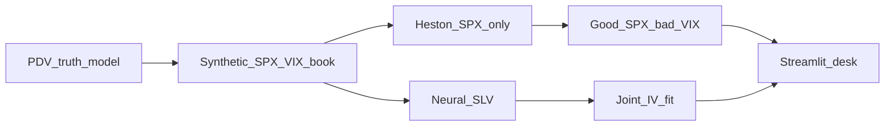

# Joint SPX/VIX Calibration via Neural Networks

A desk-interview research demo for **quantitative research (derivatives / volatility)**, **structuring**, and **risk**.

It does three things you can walk through in a screen-share:

1. Mint a synthetic but economically faithful **SPX + VIX book** from a path-dependent volatility (PDV) truth model.
2. Fit a **Heston** model to **SPX smiles only**, then freeze it and mark VIX — this is the classic joint-calibration *puzzle*.
3. Jointly calibrate a **neural stochastic local-vol SDE** (Guyon–Mustapha style) so SPX vanillas, VIX futures, and VIX options are scored in the *same* implied-vol loss.

This is **not** a production calibrator and **not** a CBOE VIX replication. It is a computationally honest slice: daily Euler Monte Carlo, small networks, three maturities, a quadratic-variation VIX proxy.

Shipped CPU checkpoint (same units as a vol desk: *vol points* = 100 × RMS vol):

| Model | SPX IV RMSE | VIX future RMSE | VIX option IV RMSE |
| --- | ---: | ---: | ---: |
| Heston (SPX-only) | 1.31 | 4.80 | 183 |
| Neural SLV (joint) | 0.97 | 1.34 | 1.70 |

The learned variance factor correlates **−0.78** with an EWMA of past log-returns — the path-dependent-vol fingerprint.

Public repo: [github.com/lahin2/joint-spx-vix-nn](https://github.com/lahin2/joint-spx-vix-nn)

---

## Screen-share script (what to say)

Open the Streamlit desk (`app.py`) and walk left-to-right:

1. **Sidebar.** One synthetic close. No Bloomberg. Truth is path-dependent vol (EWMA shock + leverage). Two models mark that book.
2. **Market & puzzle.** Heston is fit to SPX only, then frozen. SPX looks acceptable; VIX futures are cheap; VIX options are wildly too convex. That mismatch *is* the interview question.
3. **Calibration.** Joint IV loss, recovered Heston-like parameters, and \(\mathrm{corr}(V_t,\mathrm{EWMA\ of\ past\ log\ returns})\approx -0.78\). Say out loud: the SDE is still Markov in \((S,V)\); the *calibrated* factor just learned to track past returns.
4. **Risk / structuring.** Translate a 2-vol VIX miss into dollars on a $10k vega book. Show the SPX wing-fly model-risk P&L. That is the structuring punchline: you cannot finance a VIX call with an SPX put fly if the two smiles are marked with different models.

Then open [docs/EXPLANATION.md](docs/EXPLANATION.md) if they want the VIX-proxy caveat (pathwise RMS vs CBOE log-contract vs true \(\mathcal{F}_t\) VIX).

---

## Why this problem exists

Short-dated **SPX put skew** is steep. In a one-factor Heston (or naive Bergomi) model the only way to manufacture that skew is **a lot of negatively correlated vol-of-vol**. That same vol-of-vol inflates **VIX futures** and especially **VIX option convexity**. Path-dependent volatility can create SPX skew from *past returns* without an autonomous CIR shock, so VIX does not have to blow up.

Guyon & Mustapha (*Neural Joint S&P 500/VIX Smile Calibration*, Risk 2023) show a **one-factor Markov SLV** whose drift and diffusion are neural nets can fit SPX smiles, VIX futures, and VIX smiles together, and that the learned factor behaves like mean-reverting PDV.

Read the longer derivation, loss, and interview FAQ in [docs/EXPLANATION.md](docs/EXPLANATION.md).



---

## Model (what the network is)

Spot \(S\) and a variance factor \(V\):

\[
d\log S = \bigl(r - \tfrac12\sigma^2\bigr)\,dt + \sigma\,dW,\qquad
\sigma = L_\theta(t,\log S)\,\sqrt{V}
\]

\[
dV = \mu_\theta(t,\log S,V)\,dt + \nu_\theta(t,\log S,V)\,dZ,\qquad
d\langle W,Z\rangle = \rho\,dt
\]

\(L_\theta,\mu_\theta,\nu_\theta\) are tiny MLPs (2×32, tanh) sitting on a Heston-like backbone so CPU Adam does not explode. Time is a 252-day grid; the Euler scheme is fully vectorized in PyTorch.

**VIX** in this repo is *not* the listed log-contract strip. On each path at observation date \(t\),

\[
\mathrm{VIX}_t = \sqrt{\frac1\Delta\int_t^{t+\Delta}\sigma_u^2\,du}
\quad(\Delta = 21/252\text{, Riemann sum along the same path}).
\]

Market and model use that same proxy, so the joint loss is internally consistent. The gap versus \(\mathbb{E}[\sqrt{\mathbb{E}[\mathrm{QV}\mid\mathcal{F}_t]}]\) and versus CBOE VIX is documented in `docs/EXPLANATION.md` — it is a risk talking point, not a bug we hide.

**Loss** (inverse bid–ask weights, implied-vol space):

\[
\mathcal{L}
= w_{\mathrm{SPX}}\|\Sigma^{\mathrm{SPX}}_{\mathrm{mod}}-\Sigma^{\mathrm{mkt}}\|^2
+ w_{\mathrm{fut}}\|\mathrm{VIX}^{\mathrm{fut}}_{\mathrm{mod}}-\mathrm{VIX}^{\mathrm{fut}}_{\mathrm{mkt}}\|^2
+ w_{\mathrm{VIX}}\|\Sigma^{\mathrm{VIX}}_{\mathrm{mod}}-\Sigma^{\mathrm{mkt}}\|^2
\]

Common random numbers and antithetics are frozen across Adam steps so the Monte Carlo noise is not a moving target.

---

## Run locally

Python 3.10+.

```bash
pip install -e ".[dev]"
python scripts/train_checkpoint.py          # optional: rebuild artifacts/ (about a minute on CPU)
streamlit run app.py --server.port 43173 --server.address 0.0.0.0
pytest -q
```

The dashboard:

| Tab | Who it is for | What you should say |
| --- | --- | --- |
| **Market & puzzle** | QR / vol | Heston looks acceptable on SPX and fails VIX. That *is* the puzzle. |
| **Calibration** | QR | Joint IV loss, recovered \((v_0,\kappa,\theta,\xi,\rho)\), \(V_t\) band, PDV correlation. Optional extra Adam steps. |
| **Risk / structuring** | RM / structurers | Residual heatmap; 21d VIX vs 1m variance on a **$10k vega** book; SPX wing-fly model-risk P&L. |

A **2 vol-point** miss on a VIX future × **$10,000 vega** is **$20,000** of mark-to-model P&L before bid–ask. That is why \(w_{\mathrm{fut}}\) is large.

---

## Layout

```
app.py                      Streamlit vol desk
docs/EXPLANATION.md         Math, VIX proxy, interview FAQ
scripts/train_checkpoint.py Mint book, fit Heston, train neural SLV
src/spx_vix_nn/
  bs.py                     Black–Scholes + Newton implied vol
  market.py                 Synthetic PDV book
  vix.py                    Pathwise QV VIX proxy
  calibration.py            Joint IV loss + Adam
  models/pdv.py             Truth model (EWMA shocks + leverage)
  models/heston.py          SPX-only baseline, then VIX mark
  models/neural_sde.py      Neural SLV Euler scheme
artifacts/                  Pretrained checkpoint and priced book
tests/
```

---

## What is faithful vs simplified

**Faithful to Guyon–Mustapha:** one-factor Markov neural SDE, joint SPX + VIX futures + VIX smiles, leverage function, diagnosis that \(V\) tracks past returns.

**Simplified on purpose:** synthetic book (no live surface), 5d / 21d / 42d grid, QV VIX proxy rather than the CBOE discrete log-contract strip, nested conditional expectation replaced by pathwise continuation.
